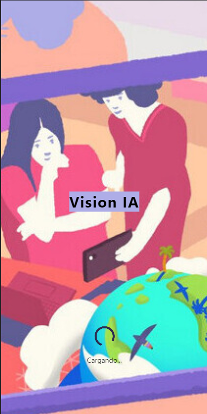
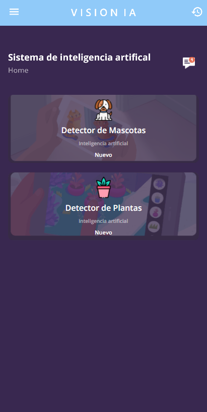
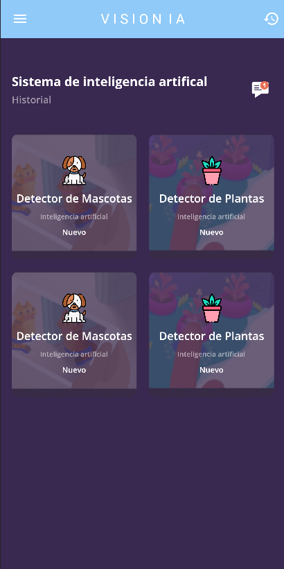

## INTERFACES

 |  | 

# visionIA-app

Proyecto de aplicación móvil con inteligencia artificial

# Planteamiento del proyecto.

Este proyecto se basa en el desarrollo de una aplicación multiplataforma, con la cual el usuario tendrá la posibilidad de utilizar múltiples herramientas de última tecnología para identificar gran parte del entorno donde se encuentre.

El usuario final tendrá la posibilidad de usar diferentes modelos de inteligencia artificial los cuales podrán brindarle una ayuda a algunas de sus necesidades.
